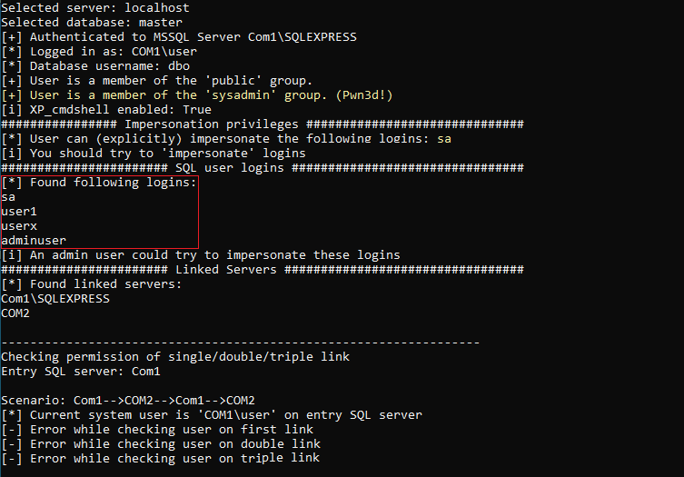
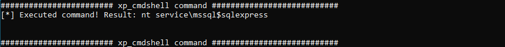
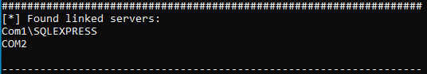
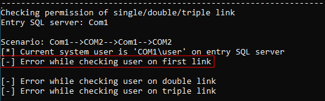
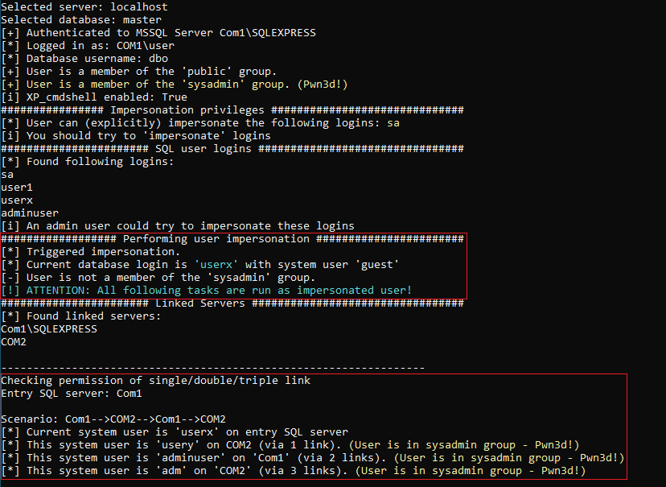
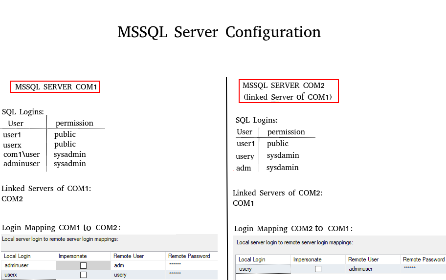

## Description

In today's increasingly interconnected data landscape, access to external data sources is crucial for the business processes of many companies. Microsoft SQL Server, in addition to local instances, also offers a powerful feature called "Linked Servers", which allows seamless access to data sources outside your local SQL Server instance. When properly configured, both local instances and Linked Servers provide a high level of security. However, in case of accidental misconfiguration, the consequences are often severe. In complex scenarios where multiple Linked Servers interact with each other, misconfigurations are often not immediately noticed. For this reason, the MSSQL ATTACK TOOL (M.A.T) was developed at SySS internally in a Research & Development project. The tool, programmed in C#, allows for the fast discovery and exploitation of vulnerabilities in MSSQL servers.

In the following article, we delve into the capabilities, functionalities, and usage of the MSSQL ATTACK TOOL, exploring how it can be leveraged to enhance the security posture of MSSQL environments. From automatic vulnerability checks to seamless execution of SQL and system commands, this tool equips security practitioners with the means to proactively identify and mitigate security risks, safeguarding the integrity and confidentiality of data stored in MSSQL databases.

## OVERVIEW OF THE FUNCTIONALITY
- **Performs automatic checks and identifies vulnerabilities**
- **Enables login via Windows Integrated Authentication as well as SQL Authentication**
- **Quickly activates XP_cmdshell if the permission exists (locally as well as on Linked Servers)**
- **Convenient execution of system commands via XP_cmdshell (locally as well as on single/double Linked Servers)**
- **Convenient execution of SQL commands (locally as well as on Linked Servers)**
- **Fast triggering of NTLM requests via XP_dirtree**
- **Custom Stored Procedure - for executing OS commands (locally)**
- **Automatically checks and enables RPC OUT (if RPC OUT is disabled for Linked Servers, stored procedures such as xp_cmdshell on Linked Servers are not usable)**
- **Automatic dumping of MSSQL user hashes**

## USAGE
```
Example: MAT.exe [options]
Example: MAT.exe --server localhost -u user1 -p password --winauth --os-command "whoami"
```

If the executable file is executed without credentials (no option "-u:" or "-p:"), it will by default attempt to log in using Windows Integrated Authentication. When started without parameters, a help output is displayed explaining the function of each parameter.

```
Options:

-s, --server           Required. SQL server
-u, --user             SQL user
-p, --password         SQL password
--winauth              Log in with Windows Integrated Authentication
-d, --database         Database name (default: 'master')
-r, --relay            Trigger an NTLM-relay to the given IP via XP_DIRTREE
-i, --impersonate      Impersonate the specified SQL user
--dumphashes           Dump MSSQL user hashes if the current user has admin permissions
-l, --linked-server    Linked SQL server
-e                     Enable XP_CMD Shell locally '-e' or on linked server '-e LINKEDSERVER'
--os-command           OS command to execute on selected target system
--sql-command          SQL command to execute on selected target system
--double-link          Execute OS command via XP_CMD shell using double link
--stoprox              Execute OS command via custom assembly stored procedure
--help                 Display this help screen.
--version              Display version information.
```

## EXAMPLE SCENARIO
During a penetration test, the user COM1\user is compromised. A local MSSQL Server instance is identified on the local server. Instead of manually connecting to the instance with various pentesting tools, the MSSQL ATTACK TOOL is used. 

```
MAT.exe --server localhost
```

The tool indicates that the compromised Windows user can log in to the SQL Server "COM1" (Windows Integrated Authentication - no need to enter username/password). The tool provides the following output:





The user is in the "sysadmin" group. This allows the user to activate the XP_CMD shell and execute system commands or list SQL user logins (which will be important later).

After the XP_cmdshell has been activated (MAT.exe --server localhost -e), system commands can be executed subsequently (MAT.exe --server localhost --os-command "whoami").

The usage of the parameter '--os-command' without using the additional parameter '--linked-server' tells the tool to execute the command locally, on the entry SQL Server (COM1).




In the next step, it can be tested whether the user COM1\user can be used to access a Linked Server. The following Linked Servers were previously identified by the MSSQL ATTACK TOOL:




When querying Linked Servers on the SQL Server, the server itself (in this case COM1) is always listed as well. The actual Linked Server here is "COM2". The direct attempt to use the compromised user to execute SQL commands on this Linked Server fails (the MSSQL Tool performs these checks automatically).



This is because there is no login mapping for the current user on COM1 (see diagram below: SQL users and permissions). The login mapping determines which user from SQL Server COM1 is associated with which user from COM2.

Therefore, it is important to know which users exist on COM1 in order to test whether a login mapping exists for any of these users (if the permissions are high enough, it is possible to directly check this in the linked server object "COM2" (on COM1) via SQL Management Studio). Previously, the MSSQL ATTACK TOOL detected the following user logins:


```
userx
user1
adminuser
```

With the "sysadmin" permission, the user com1\user can also impersonate SQL users.

Thus, an attempt can be made to impersonate the user "userx." By referring to the diagram with users/permissions (at the bottom), it becomes apparent that the impersonated user "userx" can execute SQL commands on COM2 as "usery." It is important to note that all actions performed after impersonation occur as the impersonated user. The following command was used:


```
MAT.exe --server localhost --impersonate userx
```


The use of the tool yields the following result:



In this demo scenario, the tool is not only capable of executing OS-commands locally or on the Linked Server COM2 (via 1 link) but can also use the SQL Server COM1 as a Linked Server from there (via 2 links). In a Triple Link scenario, COM1 would first connect to COM2 via a link, then back to COM1, and then again to COM2 via a link. The indication "Pwn3d!" indicates that the mapped user on the Linked Server is in the "sysadmin" group and therefore has full control over the SQL Server.

The following illustration shows the existing users of each MSSQL server along with their mappings.



## WRAPPING UP
After using the MSSQL ATTACK TOOL you should have a pretty good idea of the main security issues on your MSSQL Servers and its permissions. If you are a pentester or a red teamer, you could quickly find some misconfigurations to abuse for local privilege escalation or for lateral movement to a linked server. 

By adopting a proactive approach to security and leveraging tools like the MSSQL ATTACK TOOL, you can strengthen your organization's resilience to cyber threats and ensure the integrity and confidentiality of your data assets.
